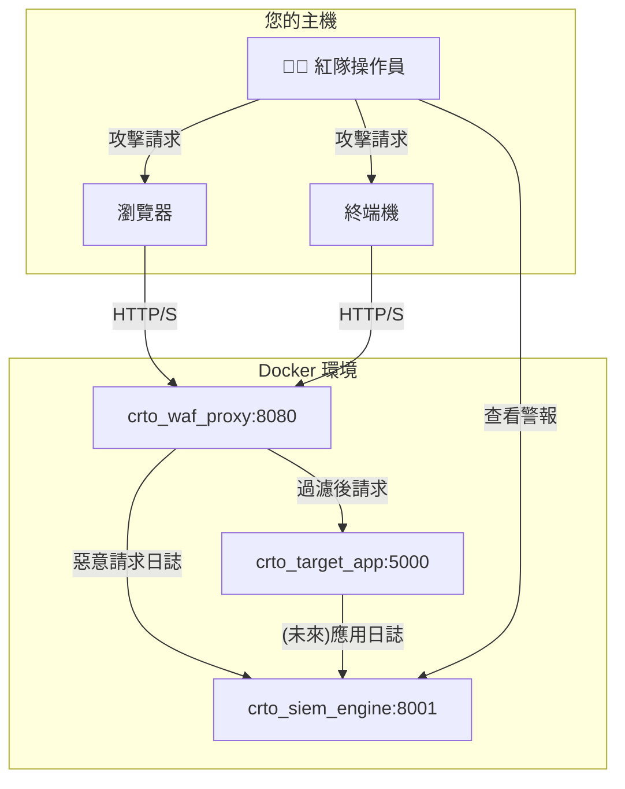

# 🚩 CRTO 紅隊演練實驗室 - 使用手冊

歡迎來到為 Certified Red Team Operator (CRTO) 打造的專屬攻擊演練實驗室！

這個環境整合了一個受 WAF 保護的 Web 應用、一個 WAF 代理和一個 SIEM 監控引擎，全部由 Docker Compose 一鍵啟動。您的任務是滲透目標，同時盡力避免被偵測到。

## 🚀 一鍵啟動實驗室

您只需要 Docker 和 Docker Compose。在終端機中運行以下指令即可啟動整個靶場環境：

```bash
docker-compose up --build
```

服務啟動後，您將擁有以下環境：

-   **攻擊目標 (WAF)**: `http://localhost:8080`
-   **SIEM 警報儀表板**: `http://localhost:8001/alerts`

## 🎯 攻擊目標與場景

### 1. 攻擊入口點

您的主要攻擊目標是運行在 `http://localhost:8080` 的 Web 應用程式。所有流量都會經過我們客製化的 WAF (`waf-proxy`)。

### 2. 目標應用程式 (`target-app`)

後端應用程式 (`target_app.py`) 包含以下幾個刻意設計的脆弱端點：

-   **`/`**: 歡迎頁面。
-   **`/search?query=<...>`** (GET): 一個搜尋頁面，直接回顯 `query` 參數，是練習 **XSS (跨站腳本攻擊)** 的絕佳目標。
-   **`/exec`** (POST): 一個接受 JSON payload `{"cmd": "<command>"}` 的端點，用於執行系統指令。這是練習 **命令注入 (Command Injection)** 的主要目標。

### 3. SIEM 儀表板 (`siem-engine`)

這是您作為紅隊操作員的「眼睛」。每次您發動攻擊後，都可以訪問以下端點來查看藍隊的反應：

-   **`http://localhost:8001/alerts`**: 以 JSON 格式列出所有被觸發的警報，最新的在前。
-   **`http://localhost:8001/alerts/latest`**: 只顯示最新的一筆警報。

**您的核心目標：** 在完成攻擊任務的同時，讓 `/alerts` 端點保持空白，或只觸發低嚴重性的警報。

## ⚔️ 演練場景 (Scenarios)

### 場景 1: WAF 繞過與 XSS

-   **目標**: 在 `/search` 端點成功執行一個 `alert('XSS')` 的 JavaScript payload。
-   **挑戰**: WAF 內建了多條 XSS 過濾規則。您需要使用編碼、混淆或其他技巧來繞過偵測。
-   **驗證**:
    1.  瀏覽器成功彈出 alert。
    2.  訪問 `http://localhost:8001/alerts`，確認沒有觸發 `XSS_ATTACK` 相關的警報。

### 場景 2: 命令注入與偵察

-   **目標**: 透過 `/exec` 端點執行 `whoami` 指令。
-   **挑戰**:
    1.  WAF 會攔截包含 `whoami`, `ls`, `cat` 等敏感關鍵字的請求。
    2.  即使繞過了 WAF，SIEM 也部署了 `R005` 規則來偵測可疑的命令列活動。
-   **練習技巧**: 命令混淆、使用替代指令、編碼 payload。
-   **驗證**:
    1.  成功收到 `whoami` 的執行結果。
    2.  訪問 `http://localhost:8001/alerts`，確認沒有觸發 `COMMAND_INJECTION` (WAF) 或 `R005` (SIEM) 警報。

### 場景 3: "活在陸地上" (Living off the Land)

-   **目標**: 模擬一個完整的攻擊鏈，從 Web 滲透到內部偵察，最終達成目標，同時將 SIEM 警報降至最低。
-   **挑戰**: 避免觸發 `C001` (多階段攻擊) 關聯警報。這需要您在執行多個攻擊步驟時，控制攻擊的頻率、來源和模式。
-   **練習技巧**: 低慢速攻擊 (Low and Slow)、流量偽裝。
-   **驗證**:
    1.  完成至少 3 個不同的攻擊步驟 (例如：命令注入 -> 檔案讀取 -> C2 連線模擬)。
    2.  訪問 `http://localhost:8001/alerts`，確認 `C001` 警報未被觸發。

## 🛠️ 實驗室架構



## 💎 CRTO 2 進階場景 (Advanced Scenarios)

以下場景專為準備 CRTO 2 或更高級別的紅隊演練而設計，專注於 Active Directory 攻擊和更隱蔽的 C2 通訊。

要運行這些場景，請在您的主機終端（或 Docker 環境內的任何容器）中執行對應的 Python 腳本。

### 場景 4: Active Directory - 黃金票據 (Golden Ticket)

-   **目標**: 模擬黃金票據攻擊，直接獲取網域管理員權限。
-   **攻擊指令**:
    ```bash
    python test_crto2_golden_ticket.py
    ```
-   **模擬行為**: 此腳本將模擬一台非 DC 的主機，向 SIEM 發送一個偽造的 Kerberos 服務票據請求事件 (Event ID 4769)，請求的目標是 `krbtgt` 帳戶。這是黃金票據攻擊的核心特徵。
-   **藍隊偵測**: SIEM 的 `R014` 規則專門監控此類異常行為。
-   **驗證**: 執行腳本後，訪問 `http://localhost:8001/alerts`，您應該會看到一條 `CRITICAL` 級別的 `R014` 警報。

### 場景 5: Active Directory - 哈希傳遞 (Pass-the-Hash)

-   **目標**: 模擬使用竊取來的 NTLM 哈希進行橫向移動。
-   **攻擊指令**:
    ```bash
    python test_crto2_pass_the_hash.py
    ```
-   **模擬行為**: 腳本會向 SIEM 發送一個偽造的登入成功事件 (Event ID 4624)，其關鍵特徵是 `Logon Type 9` (NewCredentials) 和 `Authentication Package` 為 `NTLM`。
-   **藍隊偵測**: SIEM 的 `R015` 規則旨在捕獲這種非典型的登入模式。
-   **驗證**: 執行腳本後，訪問 `http://localhost:8001/alerts`，您應該會看到一條 `HIGH` 級別的 `R015` 警報。

### 場景 6: 隱蔽 C2 通訊 (Covert C2 Communication)

-   **目標**: 建立一個難以被傳統特徵偵測的 C2 心跳包通訊。
-   **攻擊指令**:
    ```bash
    python test_crto2_c2_beaconing.py
    ```
-   **模擬行為**: 此腳本將在約一分鐘的時間內，以固定的間隔 (5秒 + 微小抖動) 模擬從一台受害者主機到外部 C2 伺服器的網路連線。
-   **藍隊偵測**: SIEM 的 `R016` **狀態化偵測規則** 會分析連線的時間規律性。它不是看單一連線的內容，而是看連線模式的**變異數**。
-   **挑戰**:
    1.  閱讀 `siem_dashboards.py` 中 `_handle_c2_beacon_detection` 的邏輯。
    2.  修改 `test_crto2_c2_beaconing.py` 中的 `interval` 和 `jitter` 參數。
    3.  嘗試找到一組參數，既能保持通訊，又能使連線間隔的變異數大於規則中的閾值 `5`，從而繞過 `R016` 偵測。
-   **驗證**: 成功繞過意味著在執行完腳本後，`http://localhost:8001/alerts` 中**沒有** `R016` 警報。

## 🤖 第三階段: EDR 偵測與 SOAR 自動化回應

在這一階段，靶場的防禦能力得到了質的提升。我們不僅僅是偵測，系統現在會**自動做出回應**。當 EDR (端點偵測與回應) Agent 偵測到惡意行為時，SIEM 會觸發 SOAR (安全編排、自動化與回應) Playbook，**立即在 WAF 層封鎖攻擊者的 IP**。

這為紅隊成員創造了一個更具挑戰性的環境：你必須在被自動化系統踢出網路之前完成你的目標。

### 場景 7: 端點偵測繞過與自動化隔離 (EDR Bypass & Automated Isolation)

-   **目標**: 模擬在受感染主機上執行 `Mimikatz` 來竊取憑證，並觀察 SOAR 的自動化防禦。
-   **攻擊指令**:
    ```bash
    python test_edr_mimikatz.py
    ```
-   **模擬行為**:
    1.  此腳本模擬 EDR Agent 偵測到 `mimikatz.exe` 進程的執行。
    2.  EDR Agent 立即將警報發送至 SIEM。
-   **藍隊偵測與回應 (重點)**:
    1.  SIEM 的 `R017` 規則捕獲到這個 EDR 警報。
    2.  `R017` 規則綁定了 `PB001_BLOCK_IP_AT_WAF` 這個 SOAR Playbook。
    3.  Playbook 被**自動觸發**，SIEM 會呼叫 (模擬的) WAF API，將產生此 EDR 事件的來源 IP (`192.168.1.105`) 加入封鎖清單。
-   **驗證與挑戰**:
    1.  執行腳本後，你應該會在終端機的輸出中看到 SOAR Playbook 被觸發的日誌，顯示 IP 正在被封鎖。
    2.  訪問 `http://localhost:8001/alerts`，你會看到一條 `CRITICAL` 級別的 `R017` 警報。
    3.  **真正的挑戰**: 你能否在 `waf_proxy.py` 或 `siem_dashboards.py` 中找到可以利用的邏輯缺陷，來繞過這個自動化的「偵測-封鎖」循環？例如，如果 EDR 日誌中缺少 `src_ip` 欄位，SOAR Playbook 還會成功嗎？

祝您演練順利，Bypass 一切！ 🚀
